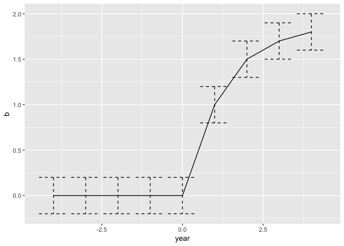
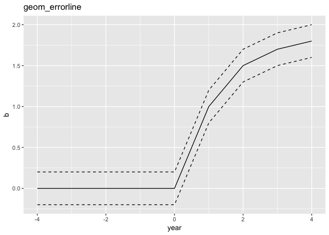

<!-- README.md is generated from README.Rmd. Please edit that file -->
A collection of `ggplot` themes and geoms loosely based on an economics theme. I'd love to hear if you've found any of these helpful or have suggestions. I'm also active on [twitter](https://twitter.com/wytham88). Currently the package consists of:

1.  An NBER theme inspired by the NBER's [Reporter](http://www.nber.org/reporter/) and [Digest](http://www.nber.org/digest/).

2.  `geom_errorline`: a geom for upper and lower bounds of an interval, with the points of the upper bound as a separate line from the points of the lower bound.

Install
-------

``` r
devtools::install_github("weiyangtham/econothemes")
```

geom\_errorline
---------------

There are many circumstances where you want to plot a line and also show some intervals around the line, such as confidence intervals. In economics you’ll see this most often in an event study or difference-in-differences, where you have coefficients for each time period before and after a treatment date. There are a number of ways to do this. For example, you can have an error bar for each coefficient.

``` r
library(tidyverse)
library(econothemes)

df <- data_frame(b = c(0, 0, 0, 0, 0, 1, 1.5, 1.7, 1.8), 
           year = -4:4)

p <- ggplot(df, aes(year, b, ymax = b + 0.2, ymin = b - 0.2)) + geom_line() 

p + geom_errorbar(linetype = 2)
```



Another way you could represent this is to give the upper bounds and lower bounds as their own lines. This can give a cleaner look than error bars if there is a series of coefficients over a long time period. This is what `geom_errorline` does.

``` r
p + geom_errorline(linetype = 2) + labs(title = "geom_errorline")
```



Note that this is the equivalent of

``` r
p + 
  geom_line(aes(y = b + 0.2), linetype = 2) +
  geom_line(aes(y = b - 0.2), linetype = 2)
```

NBER theme
----------

ggplot2 theme inspired by the NBER's [Reporter](http://www.nber.org/reporter/) and [Digest](http://www.nber.org/digest/).

The relevant functions are `theme_nber()`, `scale_color_nber()`, and `scale_fill_nber()`.

Note that the scales draw on a palette with only two colors. The NBER typically uses a sequential palette of different shades of blue, which doesn't work so well with more than two values. If you want to stay true to that style, you can try building a sequential palette with [ColorBrewer](http://colorbrewer2.org/#type=sequential&scheme=Blues&n=3) or using the [RColorBrewer](https://cran.rstudio.com/web/packages/RColorBrewer/RColorBrewer.pdf) package.

#### Example

``` r
library(gapminder)
# library(tidyverse)
# library(econothemes)

df <- filter(gapminder, country %in% c("United States", "United Kingdom"))

ggplot(df, aes(year, lifeExp, color = country)) + 
  geom_line() + 
  theme_nber() + 
  scale_colour_nber() + 
  labs(title = "Life Expectancy in US and UK", 
       subtitle = "theme_nber() example", 
       caption = "Source: Gapminder")
```


